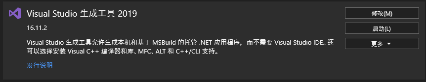

# phyphox trans2MIDI/OSC

**Reference：**

Touch OSC actually broadcasting UDP msg

[TouchOSC Bridge Connection · TouchOSC Mk1 | hexler.net](https://hexler.net/touchosc-mk1/manual/configuration-connections-bridge)

[GitHub - dorem-midi/phyphox-midi-bridge: Code that converts data received by a computer from phone Phyphox app to midi CC messages](https://github.com/dorem-midi/phyphox-midi-bridge)

[python-osc](https://pypi.org/project/python-osc/)

**Preliminaries**

**common preparation for both MIDI and OSC**

- install miniconda/PyCharm or any other python IDE

    Here I prefer to use miniconda, you can install it following the instruction delow.

    [Installing on Windows - conda 4.10.3.post29+a34aeac02 documentation](https://docs.conda.io/projects/conda/en/latest/user-guide/install/windows.html)

- VScode/Sublime Text
- You can clone my repo then, there are some ready-to-hand demo and brief introductions. (If you don't know Git, just download and unpackage it.)

    [GitHub - Rex-sys-hk/phyphox-bridge](https://github.com/Rex-sys-hk/phyphox-bridge)

- **Preparation for OSC**
    - Just install python-osc by command

        ```bash
        pip install python-osc
        ```

    - Run the demo from my repo

        ```powershell
        python ./phyphox_OSC_Bridge.py
        ```

        Then you need to designate some parameters like your phone IP:Port, OSC server host IP:PORT . Please follow the instructions step by step carefully. Please make sure the app phyphox is operating with remote access enabled and under the same LAN with your PC.

        - You can also run the simple server to find out what you sent via OSC by operating the server first

            ```powershell
            python .\OSC\simple_server.py
            ```

- **preparation for MIDI(hard to use, not recommended)**
    - install loopmidi from the following link

        [Tobias Erichsen](https://www.tobias-erichsen.de/software/loopmidi.html)

        note: loopmidi is compatible with PC(Win) only

    - install RtMidi

        [Installation - python-rtmidi 1.4.9 documentation](https://spotlightkid.github.io/python-rtmidi/installation.html#from-the-source-distribution)

        - need to install buildtools in advance

            [感谢您下载 Visual Studio - Visual Studio](https://visualstudio.microsoft.com/zh-hans/thank-you-downloading-visual-studio/?sku=BuildTools&rel=16)

            then install the 

            

    - Run python script

        ```powershell
        python ./phyphox_MIDI_lim_Bridge.py
        # or
        python ./phyphox_MIDI_free_Bridge.py
        ```

        Then you need to designate some parameters like your phone IP:Port, MIDI PORT . Please follow the instructions step by step carefully. Please make sure the app phyphox is operating with remote access enabled and under the same LAN with your PC.

**EXTENTION**

By default, the bridge can only transfer magnetometer sensor data. We have to find the keys from ethernet data following the instructions below.

**get other data** 

Press F12 in chrome at the remote access page. Then click Network to check the key name (Where gyrX, gyrY, gyrZ located for gyroscope. It would be magX... for Magnetometer). 


**PS:**

I believe all of you with a little coding experience can solve the problems on your own by a glance at the code. 

If there are any problem you can't deal with. Please publish it on the forum or in the discussion session.